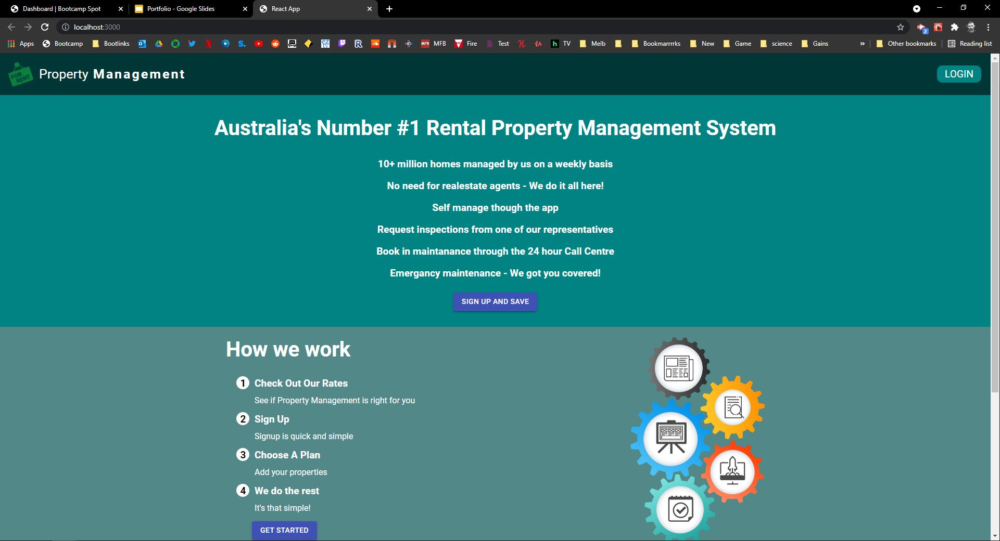
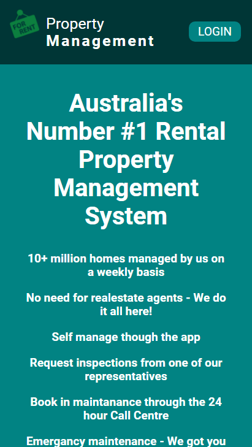

# Allied Property Management


## Table of contents

[Install Instructions](#Install)

[Links](#Links)

[Aim](#Aim)

[Prerequisites](#Prerequisites)

[Collaborators](#collaborators)

[Install Guide](#Install)

[Pictures](#Pictures)

[Future Dev](#Future-Dev-Plans)

# Links

- [GitHub Repository](https://github.com/ChrisOnions/Portfolio-Project-Mern-Stack)

- [Deployed on heroku](https://property-management-appl.herokuapp.com/)

# Aim

Real estate agents are inundated with communication from Landlords and tenants in regards to the management of properties within their portfolio

In particular, requests for property maintenance make up a large portion of correspondence received by agents which creates a bottleneck of issues leading to frustration from tenants and a flow-on effect to landlords and contractors

I propose creating an application where tenants can be directly linked to a team that manages maintenance requests, rent payments and routine property inspections on behalf of real estate agents in an effort to free up their time to take care of high level tasks

This solution will alleviate the frustration experienced by tenants who constantly have long wait times receiving attention for their maintenance issues and aims to prevent high costs passed on to landlords by not addressing maintenance issues immediately or preventing them entirely.

## User story

As a user - who is renting a property.

I want to - be able to log maintenance requests, pay rent and book inspections with ease .

So that - I can have maintenance requests dealt with promptly, communicate with contractors directly and have more control over the way my property is managed.

# Prerequisites

- Javascript
- React
- Express
- Node.js
- NPM
- MySql
- My Sql Workbench

# Install

<span style="color:green">Clone Repository</span> - (From github Repository)

<span style="color:green">NPM i</span> - (To install all required packages from package.json)

<span style="color:green">Create file .env </span> - (From github Repository)

## Env file Template

```.env
DB_NAME=RealestateApp
DB_PASSWORD= 'Password Goes HERE'
DB_USER= "userPassword"
```

<span style="color:green">Create Db</span> - (mongoDB)

## Mongo seed schema

<span style="color:green">npm run seed</span> - (mongoDB database)

<span style="color:green">npm run develop</span> - (Starts program)

<span style="color:green">Visist http://localhost:3001/</span> - (Or change PORT)

For making testing use:

<span style="color:green">Visist http://localhost:3000/graphql</span> - (Or change PORT)

<span style="color:green">Use postman/insomnia to test routes</span> - (Useage)

# Pictures




# Future-Dev-Plans

The vision for the app is to be able to make the real estate agents obsolete and give more control to tenants and landlords.
I am aiming to create a company that manages all aspects of residential real estate in an efficient way.
This app will also have the ability to collect property data for future uses and expansion.

# Collaborators

If you would like to colaborate on this project or would like to know more please see my contacts for information oh how to reach me.
